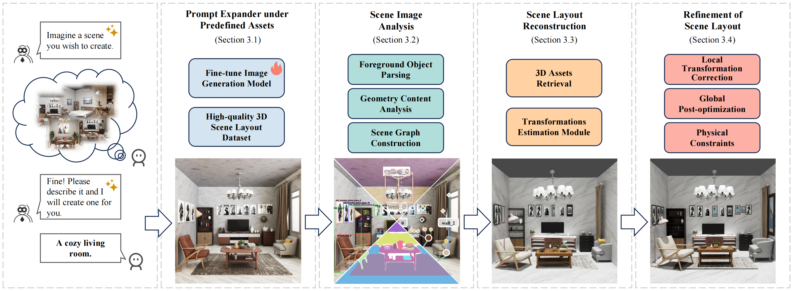

<div align="center">

# Imaginarium: Vision-guided High-Quality 3D Scene Layout Generation

[**Xiaoming Zhu***](mailto:zxiaomingthu@163.com) ${}^1$ · [**Xu Huang***](mailto:ydove1031@gmail.com) ${}^2$ · [**Qinghongbing Xie**](mailto:xqhb23@mails.tsinghua.edu.cn) ${}^1$ · [**Zhi Deng**](mailto:zhideng@mail.ustc.edu.cn) ${}^{2\dagger}$ <br> [**Junsheng Yu**](mailto:junshengyu33@163.com) ${}^3$ · [**Yirui Guan**](mailto:guan1r@outlook.com) ${}^2$ · [**Zhongyuan Liu**](mailto:lockliu@tencent.com) ${}^2$ · [**Lin Zhu**](mailto:hahmu6918@shu.edu.cn) ${}^2$ <br> [**Qijun Zhao**](mailto:qijunzhao@tencent.com) ${}^2$ · [**Ligang Liu**](mailto:lgliu@ustc.edu.cn) ${}^4$ · [**Long Zeng**](mailto:zenglong@sz.tsinghua.edu.cn) ${}^{1\dagger}$

${}^1$ Tsinghua University &nbsp; ${}^2$ Tencent &nbsp; ${}^3$ Southeast University &nbsp; ${}^4$ University of Science and Technology of China

*Equal contribution &nbsp; ${}^\dagger$ Corresponding author

**SIGGRAPH ASIA 2025 & ACM Transactions on Graphics (TOG)**

<a href="https://arxiv.org/pdf/2510.15564"></a>
<a href="https://ydove0324.github.io/Imaginarium/"></a>
<a href="https://huggingface.co/datasets/HiHiAllen/Imaginarium-Dataset"></a>
<a href="./README_zh-CN.md"></a>

</div>

---

## 📖 Introduction

**Imaginarium** is a novel vision-guided 3D layout generation system that addresses the challenges of generating logically coherent and visually appealing customized scene layouts. We employ an image generation model to expand prompt representations into images, fine-tuning it to align with our high-quality asset library. We then develop a robust image parsing module to recover the 3D layout of scenes based on visual semantics and geometric information, optimizing the scene layout using scene graphs to ensure logical coherence.



## 📢 Latest Announcements

### SceneProof final Paper30 results

The table below is the frozen reporting table for Primary objects with at
least 8,000 visible pixels. Ground truth is used only for evaluation, never
for cold-start selection or optimization.

| Version | Primary recovery | Primary parent | Rotation AUC@60 | Translation AUC@0.5 m | Physical macro |
|---|---:|---:|---:|---:|---:|
| V1 | 89.49% | **89.32%** | **48.13%** | **23.73%** | 52.98% |
| V3 cold | **91.40%** | 87.80% | 48.11% | 20.36% | 41.20% fresh evaluator; 52.14% legacy dashboard |
| V4 DeepSearch | 88.22% | 80.14% | 31.34% | 12.19% | 54.58% |
| **V5-fast / Fix61** | 88.22% | 80.14% | 31.38% | 12.14% | **62.10%** |

V5-fast preserves the V4 DeepSearch pose operating point while improving
physical macro by 7.52 percentage points. The large rotation/translation
change occurs upstream between V3 and V4 DeepSearch, rather than in the
SceneLM/Fix61 proof layer. V3 physical macro is reported with both values
because its fresh relation-conditioned evaluation and historical dashboard
used different evaluator states; they must not be mixed silently.

| Runtime scope | Mean seconds/scene | Paper30 useful GPU-hours | Speedup vs legacy S4 |
|---|---:|---:|---:|
| Cold S0--S3 | 636.949 | 5.308 | -- |
| Legacy SA-5000 S4 | 677.770 | 5.648 | 1.000x |
| **V5-fast S4 (SceneLM/Fix61)** | **192.930** | **1.608** | **3.513x** |
| Historical Fix114 repair add-on | 166.333 | 1.386 | additive |
| Historical Fix61 + Fix114 S4 | 359.263 | 2.994 | 1.887x |

The measured cold-stage means are S0 9.687 s, S1 443.036 s, S2 137.451 s,
S3 44.790 s, plus 1.986 s orchestration overhead. Thus V5-fast S0--S4 is
829.879 s/scene (6.916 useful GPU-hours over Paper30). The measured cold
S0--S3 two-A10 wall time is 2.680 hours. V3 is approximately 23.8 min/scene
and 11.9 useful GPU-hours over Paper30; this is an estimate reconstructed from
27 complete runtime rows and is labelled accordingly.

The deployed product exposes two profiles: **Fast** is frozen Fix61 and is
eligible for paper metrics; **Medium** is Fix61 plus conservative visual-safe
cleanup. Medium may relocate visibly unsupported objects or suppress a small
number of unresolved duplicates, so it is presentation-only and is not used
for quantitative paper metrics. Full provenance and caveats are recorded in
`SCENEPROOF_FINAL_EXPERIMENT_REASONING_2026-08-13.md` and
`V5_FAST_FINAL_QUALITY_SPEED_REPORT_2026-08-13.md`.

> [!IMPORTANT]
> **Update (2025.12.23):** Fixed some size and scale errors in the scene dataset and 3D asset dataset. Please re-download the updates.

> [!NOTE]
> **Todo:** We have cleaned and remade 3D assets with potential copyright risks and updated the scene layout dataset accordingly. Due to these changes, the codebase will be updated after recent tuning. Please stay tuned.

## 🚀 Updates & Optimizations (Codebase)

We have recently optimized and adjusted the codebase compared to the original paper:

- **Background Texture Support**: Introduced a background texture database with logic for retrieving and assigning textures to ceilings, floors, and walls.
- **Scene Graph "Groups"**: Introduced the concept of "Groups". Objects with repetitive visual features and similar semantics now share the same asset retrieval results, ensuring consistency (e.g., matching all dining chairs to the same asset).
- **Enhanced 3D Asset Retrieval**: Implemented a dual-mechanism retrieval system using both Local and Global image feature matching, combined with VLM for object size optimization. This improves robustness against occlusion and complex scenes.

## 🛠️ Installation

### 1. Clone the Repository
```bash
git clone https://github.com/HiHiAllen/Imaginarium.git
cd Imaginarium
```

### 2. Create Conda Environment
```bash
conda create -n imaginarium python=3.10
conda activate imaginarium
```

### 3. Install Dependencies
```bash
pip install -r requirements.txt
```

### 4. Configure Blender Environment
This project uses Blender 4.3.2 for rendering and processing, though versions 4.0+ are generally supported.

- **Setup**: Extract Blender to `./third_party/blender-4.3.2-linux-x64` and install dependencies:
> **Note:** A pre-configured Blender package is available on HuggingFace at [🤗 blender-4.3.2-linux-x64.tar.gz](https://huggingface.co/datasets/binicey/Imaginarium-3D-Derived-Dataset).
> **Important:** Even if you use the pre-configured package, you **must still run** the installation script below to configure system paths correctly.
```bash
# Ensure blender is extracted to the correct path
bash blender_install.sh
```


---

## 📦 Data Preparation

The 3D scenes and asset dataset are hosted at [🤗 HiHiAllen/Imaginarium-Dataset](https://huggingface.co/datasets/HiHiAllen/Imaginarium-Dataset), and the derived dataset is hosted at [🤗 binicey/Imaginarium-3D-Derived-Dataset](https://huggingface.co/datasets/binicey/Imaginarium-3D-Derived-Dataset).

### 1. 3D Scenes and Asset Dataset Downloads

Choose the appropriate package based on your needs:

#### Plan A: Full 3D Scene Layout Dataset (Research)
For full access to Blend source files, RGB renders, instance segmentation, bounding boxes, depth maps, and meta-info (captions, scene graphs, object poses), download:
- `imaginarium_3d_scene_layout_dataset_part1.tar.gz`
- `imaginarium_3d_scene_layout_dataset_part2.tar.gz`
- `imaginarium_3d_scene_layout_dataset_part3.tar.gz`
- `imaginarium_3d_scene_layout_dataset_part4.tar.gz`

**Structure (e.g., bedroom_01):**
```text
bedroom_01/
  ├── bedroom_01.png
  ├── bedroom_01.blend
  ├── bedroom_01_bbox_overlay.png
  ├── bedroom_01_depth_vis.png
  ├── bedroom_01_depth.npy
  ├── bedroom_01_detect_items.pkl
  ├── bedroom_01_meta.json
  └── bedroom_01_segmentation.png
```

#### Plan B: Flux Fine-tuning Data Only
If you only need data for fine-tuning Flux (RGB images & meta-info), download:
-  `flux_train_data.tar.gz`

#### Plan C: Running Imaginarium (Inference)
To run the algorithm using our provided weights, you need the 3D Asset Library and metadata:
- `imaginarium_assets.tar.gz` (3D Models)
- `imaginarium_assets_internal_placement_space.tar.gz` (Internal Placement Spaces Info)
- `imaginarium_asset_info.csv` (Metadata)
- `background_texture_dataset.tar.gz`（Background Texture Dataset）
- *(Optional)* `imaginarium_asset_info_with_render_images.xlsx` (Visual Reference)

> **💡 Tip:** `imaginarium_asset_info.csv`, `imaginarium_asset_info.xlsx`, and `imaginarium_asset_info_with_render_images.xlsx` may be updated over time. For simply running the scene generation pipeline, the `asset_data/imaginarium_asset_info.csv` already included in this repo is sufficient.

### 2. Derived Data Preparation

The algorithm requires derived data: pose renders, DINOv2 embeddings, AENet embeddings, and voxels.
**We strongly recommend downloading our pre-processed data** to save significant time.

**Step 0: Download & Organize Files (Crucial)**
Before running any scripts, please **download** the available derived data from [🤗 binicey/Imaginarium-3D-Derived-Dataset](https://huggingface.co/datasets/binicey/Imaginarium-3D-Derived-Dataset) and **extract** them into the `asset_data/` directory.

1.  **Download List**:
    *   **Render Results** (**Recommended**): `imaginarium_assets_render_results_part[1-4].tar.gz`
    *   **DINOv2 Embeddings** (Optional): `imaginarium_assets_patch_embedding.tar.gz`
    *   **Voxels** (Optional): `imaginarium_assets_voxels.tar.gz`

2.  **Extract & Organize**:
    Ensure your `asset_data/` folder looks like this before proceeding:
    ```text
    asset_data/
    ├── imaginarium_assets/                  # From Section 1 (Plan C)
    ├── background_texture_dataset/                  # From Section 1 (Plan C)
    ├── imaginarium_assets_internal_placement_space/ # From Section 1 (Plan C)
    ├── imaginarium_assets_render_results/   # Extracted from Step 0
    ├── imaginarium_assets_patch_embedding/  # Extracted from Step 0 (Optional)
    ├── imaginarium_assets_voxels/           # Extracted from Step 0 (Optional)
    └── imaginarium_asset_info.csv           # From Section 1 (Plan C)
    ```

---

**Data Generation Scripts**
If you have downloaded and extracted the files above, you can skip the corresponding steps.

**Step 1: Render Multi-view Images (for Pose Estimation)**
> ⚠️ **SKIP if downloaded**: This step takes 1-2 days. If you have extracted `imaginarium_assets_render_results`, skip this.
```bash
python scripts/render_fbx_parallel.py \
    --input_dir asset_data/imaginarium_assets \
    --output_dir asset_data/imaginarium_assets_render_results \
    --num_gpus 8
```

**Step 2: Extract DINOv2 Patch Embeddings (for Retrieval)**
> ⚠️ **SKIP if downloaded**: If you have extracted `imaginarium_assets_patch_embedding`, skip this.
> *Prerequisite: Requires `imaginarium_assets_render_results`.*
> Time: Minutes
```bash
python scripts/save_asset_patch_embedding_dinov2.py \
    --input_dir asset_data/imaginarium_assets_render_results \
    --output_dir asset_data/imaginarium_assets_patch_embedding
```

**Step 3: Extract AENet Embeddings (for Pose Matching)**
> ⚠️ **Required (Do Not Skip)**: We **do not** provide this data in the download to save bandwidth. Please generate it locally.
> *Prerequisite: Requires `imaginarium_assets_render_results`.*
> Time: 2 hours
```bash
python scripts/extract_template_embedding.py \
    --input_dir asset_data/imaginarium_assets_render_results \
    --ae_net_weights_path weights/ae_net_pretrained_weights.pth \
    --ori_dino_weights_path weights/dinov2_vitl14.pth
```

**Step 4: Precompute Voxels (for Layout Optimization)**
> ⚠️ **SKIP if downloaded**: If you have extracted `imaginarium_assets_voxels`, skip this.
> *Prerequisite: Requires `imaginarium_assets`.*
> Time: Minutes
```bash
python scripts/precompute_voxels.py \
    --fbx_dir asset_data/imaginarium_assets \
    --output_dir asset_data/imaginarium_assets_voxels
```

**Step 5: Convert FBX to Blend (Optional, for Faster Loading)**
> ⚠️ **Optional**: Converts `.fbx` assets to native `.blend` files for significantly faster loading in Stage 2.
> *Prerequisite: Requires `imaginarium_assets`.*
> Time: ~20 Minutes (depends on disk speed)
```bash
blender --background --python scripts/convert_fbx_to_blend.py -- --fbx_dir asset_data/imaginarium_assets --parallel --workers 8
```

### 3. Model Checkpoints
Please download the following weights and place them in the `weights/` directory:

From [🤗 HiHiAllen/Imaginarium-Dataset](https://huggingface.co/datasets/HiHiAllen/Imaginarium-Dataset):
- `imaginarium_finetuned_flux.pth`

From [🤗 binicey/Imaginarium-3D-Derived-Dataset](https://huggingface.co/datasets/binicey/Imaginarium-3D-Derived-Dataset):
> *Note: We host these third-party weights (DINOv2, AENet, Depth Anything V2) for convenience. You can also obtain them from their official repositories.*
- `dinov2_vitl14.pth`
- `ae_net_pretrained_weights.pth`
- `depth_anything_v2_metric_hypersim_vitl.pth`

### 4. Final File Structure
After completing all steps, your project directory should look like this:

```text
Imaginarium/
├── asset_data/
│   ├── imaginarium_assets/                    # 3D Assets (FBX files and transformed blender)
│   ├── imaginarium_assets_render_results/     # Rendered images & poses
│   ├── imaginarium_assets_patch_embedding/    # Generated in Step 2
│   ├── imaginarium_assets_internal_placement_space   
│   ├── imaginarium_assets_voxels              # Generated in Step 4
│   └── imaginarium_asset_info.csv             
├── weights/
│   ├── imaginarium_finetuned_flux.pth
│   ├── dinov2_vitl14.pth
│   ├── ae_net_pretrained_weights.pth
│   └── depth_anything_v2_metric_hypersim_vitl.pth
├── third_party/
│   └── blender-4.3.2-linux-x64
└── ...
```

---

## ⚙️ Configuration

1. **Create Config File**:
   ```bash
   cp config/config-example.yaml config/config.yaml
   ```

2. **Set API Keys**: Edit `config/config.yaml`.
   *   **LLM Configuration**: Enter your API key and endpoint.
       *   *Note: We used `claude-4-5-sonnet` for recent testing and debugging.*
   *   **Grounding DINO**: Obtain your API token from [DeepDataSpace](https://deepdataspace.com/request_api) or the [Grounding-DINO API](https://github.com/IDEA-Research/Grounding-DINO-1.5-API) repository.

---

## 🚀 Usage

The pipeline consists of two stages:

### Stage 1: Text-to-Image (T2I)
Generate a scene image using the fine-tuned Flux model.
> **Note:** Recommended to run on **A100** GPU.
```bash
python run_imaginarium_T2I.py --prompt 'A cozy living room featuring comfortable armchairs, a gallery wall, and a stylish coffee table.' --num 4
```

### Stage 2: Image-to-3D Layout (I2Layout)
Recover the 3D layout from the generated image.
> **Note:** Capable of running fully on **RTX 3090** and above.
> **Note:** The first run may take a while, please be patient.
```bash
# Basic run
python run_imaginarium_I2Layout.py demo/demo_0.png

# Clean previous results before running
python run_imaginarium_I2Layout.py demo/demo_0.png --clean

# Debug mode (visualizes and prints detailed intermediate results)
python run_imaginarium_I2Layout.py demo/demo_0.png --clean --debug
```

---  

## 🎨 Fine-tuning FLUX  
If you’d like to fine-tune Flux on your own dataset, we provide a training script.  

1. **Prepare your data**: organize it in a HuggingFace Datasets-compatible format (e.g., an image folder or JSONL).  
2. **Launch training**:

```bash
cd scripts/flux
bash train.sh
```

---

## 🆕 Adding New Assets

To add new FBX models to the library:
1. Update `asset_data/imaginarium_asset_info.csv` with the new asset metadata.
2. Run the **Derived Data Preparation** scripts (Steps 1-5) to generate necessary rendered images, embeddings and voxels.

---

## 📜 License

- **3D Scene Dataset**: **CC BY-NC-SA 4.0**.
    Copyright © Imaginarium Team.
- **3D Asset Dataset**: **CC BY-NC-SA 4.0**.
    This dataset combines assets from three sources: **our internal team**, **open-source communities**, and **UE Fab** (used with explicit authorization). Full credits and sources are detailed in the metadata.

---

## 🔗 Citation

If you find our work useful in your research, please consider citing:

```bibtex
@article{zhu2025imaginarium,
  title={Imaginarium: Vision-guided High-Quality 3D Scene Layout Generation},
  author={Zhu, Xiaoming and Huang, Xu and Xie, Qinghongbing and Deng, Zhi and Yu, Junsheng and Guan, Yirui and Liu, Zhongyuan and Zhu, Lin and Zhao, Qijun and Liu, Ligang and others},
  journal={arXiv preprint arXiv:2510.15564},
  year={2025}
}
```

---

## 🙏 Acknowledgements

We thank the authors of [GigaPose](https://github.com/nv-nguyen/gigapose), [Depth Anything V2](https://github.com/DepthAnything/Depth-Anything-V2), and [Grounding DINO 1.5](https://github.com/IDEA-Research/Grounding-DINO-1.5-API).

**Special Thanks to 3D Artists**
Our deepest gratitude goes to the related 3D artists from the open-source community and UE Fab. Your creative contributions are the foundation of this project.

**Finally, a heartfelt thank you to everyone who contributed to Imaginarium!**
