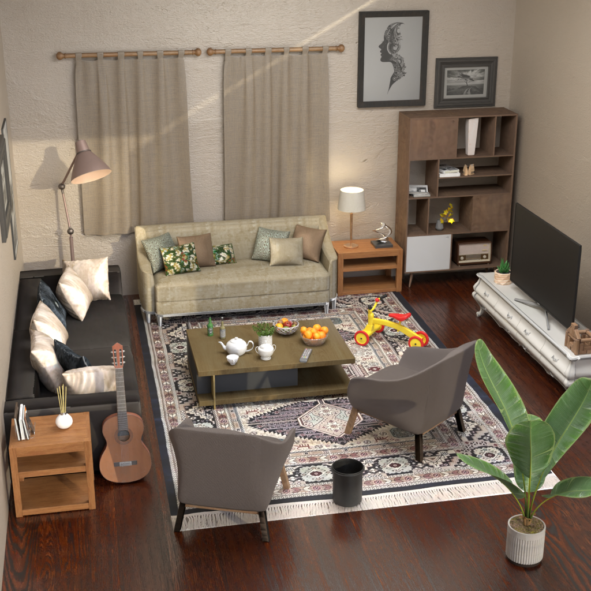
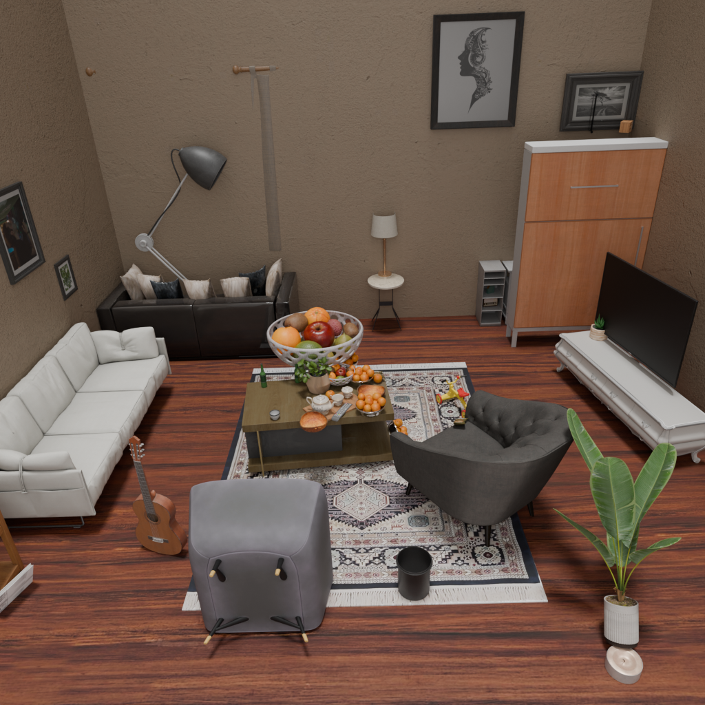
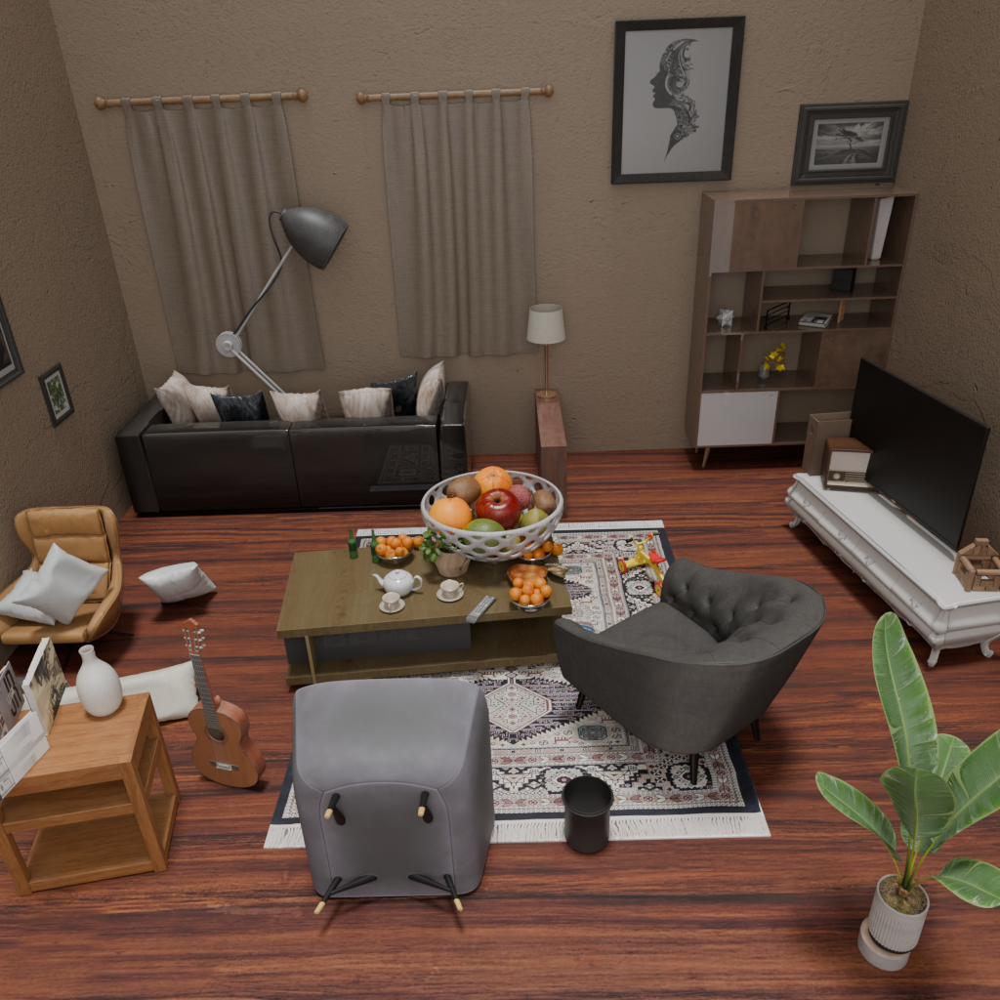
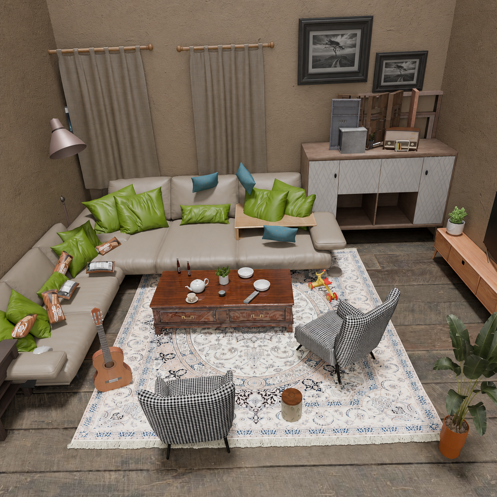
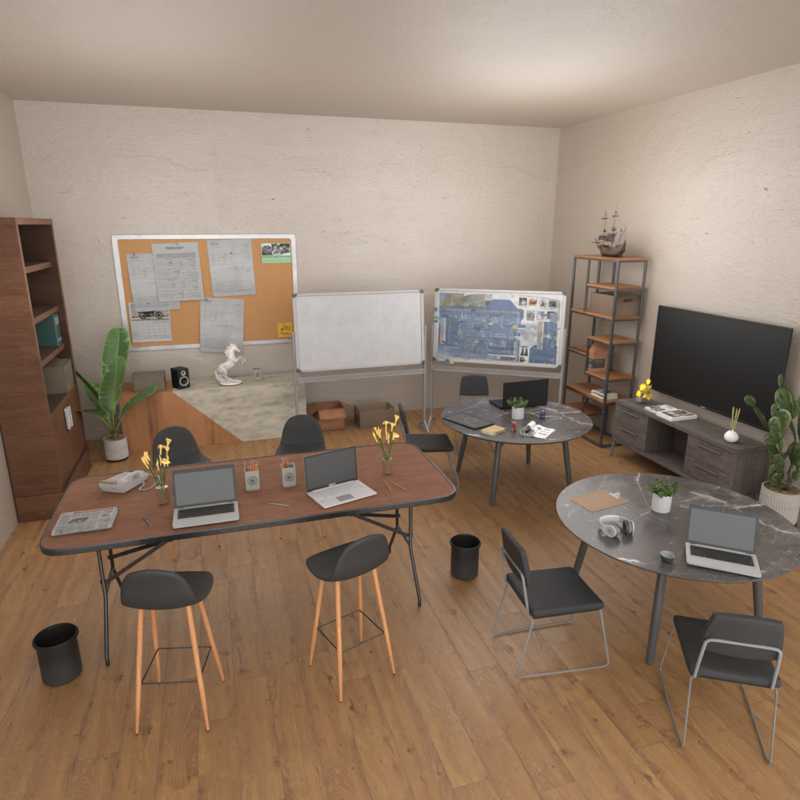
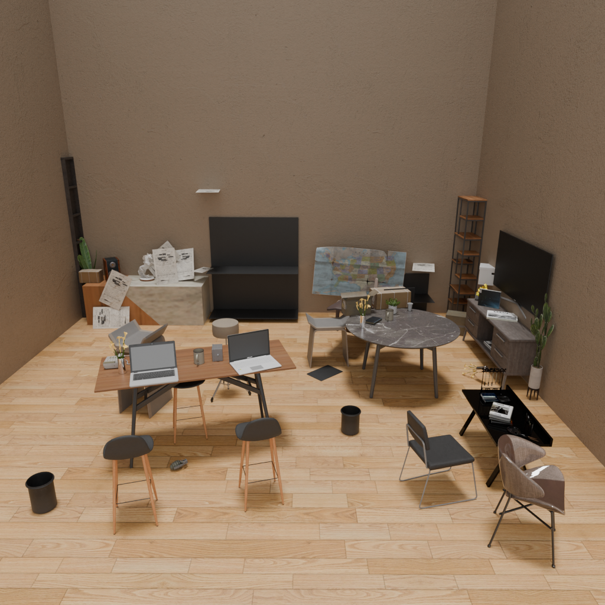
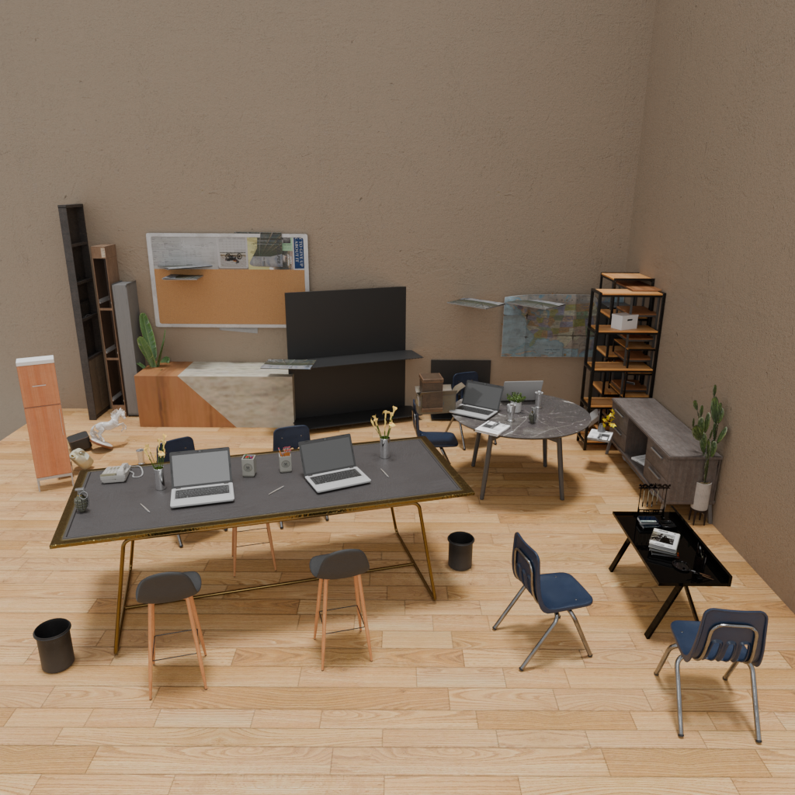
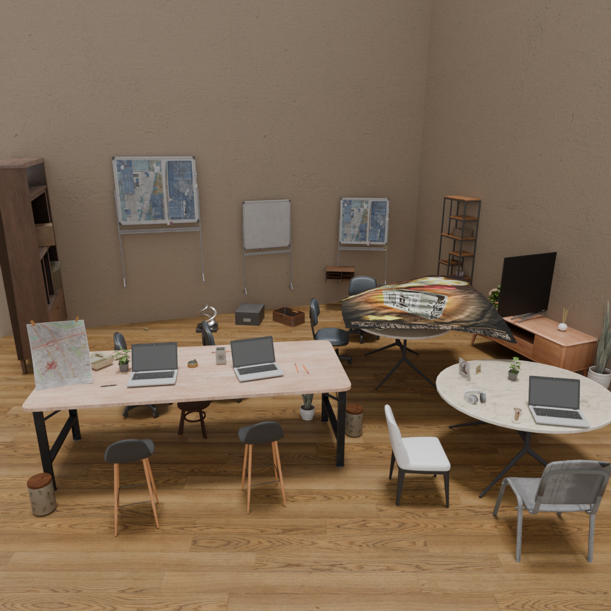

# Lumenarium

> **已部署服务 / Hosted service:** [https://embedding.lightart.qq.com/](https://embedding.lightart.qq.com/)<br>
> 上传任意尺寸的室内 PNG/JPEG（服务会保持比例并补边到 1024×1024），即可获得可编辑布局、最终渲染、质量证书和完整结果包。

[Project page](https://hanshengzhu0001.github.io/Lumenarium/) · [GitHub](https://github.com/hanshengzhu0001/Lumenarium) · [中文说明](#中文说明) · [直接使用](#直接使用已部署的-lumenarium) · [从零部署](#从零部署-lumenarium) · [English guide](#english-guide)

# 中文说明

**Lumenarium 是一个面向室内场景的单图三维重建系统，结合支撑关系推理、快速语言模型布局优化和可验证的物理修复。**

系统从一张室内图片恢复可编辑的物体、资产、位姿与关系：S0--S3
负责几何初始化、图像解析、资产检索和姿态估计，S4 使用 SceneLM 优化布局，
再由 SceneProof 对碰撞、支撑和局部修复进行证书化检查与回滚。

**项目贡献者：** Hansen Zhu、Calvin Gu
**演示视频：** [Bilibili：Lumenarium 端到端演示](https://www.bilibili.com/video/BV1tpbD6hERB/)

Lumenarium 建立在开源项目
[Imaginarium](https://github.com/HiHiAllen/Imaginarium) 之上。继承部分的作者、
许可证和论文引用保留在文末；上述贡献者指本仓库中的 Lumenarium 扩展。

## Demo

下列图片由双 A10 上部署的 Lumenarium 直接生成，不是人工搭建或 GT 场景：

<table>
  <tr>
    <td width="50%"></td>
    <td width="50%"></td>
  </tr>
  <tr>
    <td align="center"><b>办公室场景</b></td>
    <td align="center"><b>客厅场景</b></td>
  </tr>
</table>

## 跨版本视觉对比

每行从左到右依次为 **输入图、Imaginarium V1、Lumenarium V3、Lumenarium V5**。
V3 是加入结构化支撑推理后的中间版本；V5 统一表示当前 Fast、Medium、Best 产品线，
其中下图采用最终可视化结果。两组例子都来自相同输入，不是人工重排。

<table>
  <tr>
    <td width="25%"></td>
    <td width="25%"></td>
    <td width="25%"></td>
    <td width="25%"></td>
  </tr>
  <tr><td align="center"><b>Input</b></td><td align="center"><b>V1 · Imaginarium</b></td><td align="center"><b>V3 · Support-aware</b></td><td align="center"><b>V5 · Lumenarium</b></td></tr>
  <tr>
    <td width="25%"></td>
    <td width="25%"></td>
    <td width="25%"></td>
    <td width="25%"></td>
  </tr>
  <tr><td align="center"><b>Input</b></td><td align="center"><b>V1 · Imaginarium</b></td><td align="center"><b>V3 · Support-aware</b></td><td align="center"><b>V5 · Lumenarium</b></td></tr>
</table>

这些图展示的是系统级 trade-off：V5 优先保证**资产完整性、生成速度、低穿模和物体间关系**；
DeepSearch 缩短检索链路并扩大资产覆盖，但单体资产的精确 rotation/translation 可能低于 V1/V3。
在光子技术美术应用中，我们把整体场景可用性放在单体 pose 误差与少量非关键悬空之前；
论文评测仍明确保留这项限制，不把视觉改善误报为 pose 提升。

## 主要结果

Paper30 只统计可见实例掩码面积不少于 8,000 像素的 Primary 物体。
GT 仅用于评测，不参与冷启动选择或优化。由于 DeepSearch 姿态工作点仍需重新校准，
README 主表暂不报告 rotation/translation。

| 版本 | Primary recovery | Primary parent | Physical macro | 定位 |
|---|---:|---:|---:|---|
| Imaginarium V1 | 89.49% | **89.32%** | 52.98% | 原始系统基线 |
| Lumenarium V3 | **91.40%** | 87.80% | 52.14% | 支撑感知精度基线 |
| V4 DeepSearch | 88.22% | 80.14% | 54.58% | DeepSearch 检索与上游姿态 |
| **Lumenarium V5-fast / Fix61** | **88.22%** | **80.14%** | **62.10%** | 论文与 API 主版本 |

V5-fast 保持 V4 DeepSearch 的 recovery/parent 工作点，同时把 physical macro
提高 **7.52 个百分点**。V5-medium 从同一个 Fix61 结果出发，执行保守的
visual-safe 清理；它可能移动明显悬空的物体，或从最终渲染中隐藏少量无法安全摆放的
重复叶子物体，因此仅用于展示，不计入论文定量主表。

## 全链路速度

| 版本 | 端到端平均时间/场景 | S4 时间/场景 | 相对 V1 端到端 | 口径 |
|---|---:|---:|---:|---|
| Imaginarium V1 | ≈23.8 min | 677.770 s | 1.00× | 由历史完整运行恢复的近似值 |
| V4 DeepSearch | ≈21.9 min | 677.770 s | ≈1.09× | S0--S3 实测 + legacy S4 |
| **Lumenarium V5-fast** | **13.83 min** | **192.930 s** | **≈1.72×** | Paper30 冷启动实测 |

V4 的主要收益来自 DeepSearch 缩短资产检索；V5 的结构性加速来自 SceneLM：它不再对整间房执行
5,000 步模拟退火，而是把 support、collision、plane 和 semantic 关系编译为 Relation Programs，
只更新违反约束的对象与自由度，并通过精确 leaf-translation Schur elimination 消去安全的局部变量。
因此 S4 从 677.770 秒降至 192.930 秒，即 **3.513×**。

**复现这个数字需要两个显式设置，代码默认值给不出它。** 第一，`IMAGINARIUM_LAYOUTVLM_SOLVER`
的代码默认值是 `adam`（`modules/S4_blender_layout_and_corr.py:11128`）；上面这条二阶路径由跑法脚本
显式设为 `v5_scenelm`（`scripts/run_sceneproof_fix43_inloop_fullstack_smoke5_fix56.sh`，
报告与线上服务共用）。按默认值直接跑得到的是一阶路径，复现不出该数字。第二，**这条路径上的迭代预算是
2 步 LM 迭代，不是 5,000 步**：同一脚本里写着 `IMAGINARIUM_LAYOUTVLM_ITERATIONS=2`，而 2 是稳定
线性化门允许的最小值（`modules/_s4_layoutvlm_ops.py:3707` 在 iterations 小于
`SCENEPROOF_STABLE_LINEARIZATIONS` 时直接报错）。也就是说这个预算是为通过该门选定的，不是收敛性
调优的结果。报告 3.513× 时必须同时声明这个预算差——SA-5000 的 5,000 次随机试探，对二阶求解器的
2 次带守卫迭代。该预算是否欠收敛尚无结论，实测入口是
`scripts/run_scenelm_iteration_budget_frontier_smoke1.sh`。

| 阶段 | 平均秒/场景 | Paper30 有效 GPU 小时 | 说明 |
|---|---:|---:|---|
| S0 几何/深度 | 9.687 | 0.081 | 相机与房间几何初始化 |
| S1 图像解析 | 443.036 | 3.692 | 检测、分割、场景图与语义 |
| S2 DeepSearch 检索 | 137.451 | 1.145 | 三维资产检索 |
| S3 姿态估计 | 44.790 | 0.373 | 姿态推理与序列化 |
| 调度开销 | 1.986 | -- | 计时闭合项 |
| **S0--S3 小计** | **636.949** | **5.308** | 双 A10 实测墙钟时间 2.680 小时 |
| V5-fast S4：SceneLM + Fix61 | 192.930 | 1.608 | 相对 legacy S4 **3.513x** |
| **V5-fast S0--S4 总计** | **829.879** | **6.916** | 13.83 分钟/场景 |

Legacy SA-5000 S4 为 677.770 秒/场景。最终 256 samples 的 Paper30 渲染在
双 A10 上墙钟时间为 415.570 秒，未计入 S0--S4 算力。当前稳定配置下 Gemini
有效并发为 1；若端点能稳定承载 8 并发并解除全局锁，预计 S1 可降至约
250--320 秒，V5-fast 冷启动全链路约为 637--707 秒/场景，即预计节省
123--193 秒、端到端加速约 1.17--1.30x。该区间是容量规划估算，不是论文实测。

## 两项主要创新

1. **支撑感知的场景重建（V1 到 V3）。** 将 floor/wall/ceiling、父子支撑树、
   堆叠关系和结构缺失回退显式写入场景表示，避免只依赖二维相似度或孤立位姿。
2. **SceneLM + SceneProof（V4 到 V5）。** 使用关系约束的语言模型优化替代
   SA-5000 主路径，并把每次修改包装成可审计事务：局部 gate、精确碰撞/支撑检查、
   aggregate non-regression 和 scoped rollback 共同决定是否提交。

SceneProof 提升 physical macro 的原因不是“模型更敢移动”，而是**错误改动不能静默提交**：
候选必须同时通过真实网格碰撞、支撑接触、COM/边界、关系一致性和 family-level non-regression；
失败就恢复 incumbent，证据不足则显式标记 unresolved。V4 与 V5 的 recovery/parent 工作点完全相同，
而 physical macro 从 54.58% 升至 62.10%，因此这 **+7.52 pp** 可归因于 S4 的定向优化与证明层。

相对 Imaginarium，本仓库还加入 DeepSearch 检索、SAM3/低类别恢复、缺失结构 OBB
回退、堆叠感知姿态序列化、true-mesh COM/contact/overhang 审计、独立对象 settle、
visible-support certificate、可复用冷启动缓存、双 GPU worker、Web/API 打包和
8000px+ Primary 统一评测协议。

## 直接使用已部署的 Lumenarium

> **不需要安装代码、Blender、模型或数据。** 技术美术和评审用户应优先使用网页；只有维护者、研究复现或私有部署才需要执行后面的安装流程。

1. 打开 [https://embedding.lightart.qq.com/](https://embedding.lightart.qq.com/)。
2. 上传任意尺寸 PNG/JPEG；服务会保持宽高比并补边为 1024×1024。推荐使用完整室内视图，避免严重裁切和鱼眼畸变。
3. 选择模式：

   | 模式 | 适合场景 | 行为 |
   |---|---|---|
   | **V5-fast** | 论文定量、快速预览 | 冻结 Fix61，不执行展示性删除 |
   | **V5-medium** | 演示、技术美术交付 | Fix61 + 保守 visual-safe 清理 |
   | **V5-best** | 最高物理完整性 | 单次 V5-fast + 全对象真实支撑审计与事务化 first-contact 掉落 |
   | **V5-demo** | 现场演示 | 与 V5-best 完全相同的流水线，但 trial seed 取自已排练过的那次运行，而不是由 job id 派生 |
4. 点击 **Generate scene**。新图完整运行 S0--S4；字节完全相同的图片复用冻结的
   S0--S3/Fix61 缓存。切换模式时会从共享缓存继续，只运行对应的最终策略。
5. 等待页面依次显示 S0、S1、S2、S3、S4 完成，然后下载结果 ZIP。

**V5-demo 的前提**：seed 是单机状态，仓库里不携带。未钉住时 `POST /v1/jobs` 直接返回
422，而不会退回派生 seed——否则页面照样显示成功，而实际跑的是另一个随机样本。钉住方式：

```bash
python scripts/pin_sceneproof_demo_seed_fix154.py list        # 列出本机每次运行的 seed
python scripts/pin_sceneproof_demo_seed_fix154.py set <seed|job_id>
curl -s http://127.0.0.1:8080/v1/releases/current             # demo_pin 字段可复核
```

跑完后页面会显示实际使用的 trial seed，`result.json` 里的 `trial_seed` 也应与钉住值一致。
需要注意 seed 只约束本机随机源：VLM 服务端不承诺跨请求可复现，所以冷启动是「高度相似」
而非逐位一致；要逐位一致就不要勾选 cold start，让它命中冻结缓存。

需要重新运行时有两个不同选项：**Re-run only the selected final profile** 仍复用
冻结的 S0--S3/Fix61，只重跑最终策略；**Force a new cold S0-S4 run** 会忽略冻结
缓存并重新执行全部阶段，适合测试随机冷启动，但通常需要 10--15 分钟/场景。

ZIP 中包含：

```text
placement.json     可编辑的物体位姿与关系
geometry.json      支撑审计与人工复核使用的冻结几何快照
render.png         使用源 S3 相机渲染的最终图片
evaluation.json    证书、修复、回滚与 unresolved 对象
result.json        版本、模式、状态和各阶段耗时
sceneproof-result.zip
```

`succeeded` 表示流水线与证书通过；`unresolved` 表示已生成结果，但仍有无法安全自动
修复的可见关系；`failed` 才表示流水线执行失败。

V5-best 不再运行三次冷启动。它从同一个 Fix61 incumbent 出发，按支撑层级从低到高审计
所有重建对象，包括缺少 declared parent 的普通物体。具有完整 wall/ceiling attachment
证据的对象保持不动；其他对象先尝试不超过 0.15 m 的真实支撑面切向修正，否则在当前
footprint 下寻找最高 true-mesh surface，并执行冻结 XY、SO(3) 与 scale 的 Z-only
first-contact drop。每个对象都是独立事务：移动后若产生新碰撞或未形成真实接触，立即恢复
Fix61 并标记 unresolved。默认最大掉落距离为 3.0 m，可通过
`SCENEPROOF_API_BEST_MAXIMUM_DROP_M` 调整。该模式只需一次冷启动，但在完成 Paper30
非劣验证前不计入论文定量主表。

## 从零部署 Lumenarium

> **目标：** 从一个干净的 Linux x86_64 主机开始，用仓库脚本准备 Python、Blender、模型、资产和 API 服务。密钥只写入被 Git 忽略的 `.env.lumenarium`，任何 Agent 都不应把密钥输出到日志、提交或聊天。

### 1. 检查最低配置

最低验证配置为 Linux x86_64、1 张至少 22 GB VRAM 的 NVIDIA GPU、16 逻辑核、64 GB
内存和 250 GiB 可用空间；生产推荐双 NVIDIA A10、32+ 逻辑核、128 GB 内存与
500 GB NVMe。完整冷启动还需要 Gemini-compatible 视觉 API 和 DeepSearch
`/search` 服务。

### 2. 获取代码并执行一次性安装

```bash
git clone https://git.woa.com/USD/BowerPhys.git Lumenarium
cd Lumenarium
bash scripts/bootstrap_lumenarium.sh all
```

腾讯工蜂使用 HTTPS + 业务 AD 认证。首次 `clone`/`pull` 时，在 Git 提示中输入业务
AD 英文账号和 AD 密码（或工蜂访问令牌）；不要把凭据写入仓库或发给其他人。已有目录
更新到最新 `master`：

```bash
cd "$HOME/Lumenarium"
git status --short
git remote set-url origin https://git.woa.com/USD/BowerPhys.git
git pull --ff-only origin master
```

`git status --short` 必须为空；若有输出，先保留并处理本地实验改动，不要直接覆盖。

以上命令仅适用于能够访问工蜂并完成 AD 认证的内网开发机。部署在公有云域的 A10
主机不能直接访问工蜂；`403` 不是缺少某个应当上传到服务器的密码。A10 使用 WeTERM
的 `rz` 接收发布 tar 包并覆盖对应源码，实验数据、模型、缓存和 `.env.lumenarium`
不会包含在发布包中。tar 部署目录默认没有 `.git`，因此在 A10 上执行 `git pull` 报
`not a git repository` 是预期行为。不要把业务 AD 密码保存到 A10。

安装脚本会准备 Micromamba/Python 3.11、CUDA/Python 依赖、Blender 4.3.2、模型权重、
资产库与派生 embedding/voxel，并创建 `.env.lumenarium` 模板。模型和数据不存入 Git；
首次下载需要可访问 Hugging Face，受限模型需要先设置 `HF_TOKEN`。

### 3. 配置两类外部 API 和内部 worker token

```bash
cp .env.lumenarium.example .env.lumenarium
chmod 600 .env.lumenarium
vi .env.lumenarium
```

必须配置。由于继承代码需要兼容旧接口，三个 Gemini 配置项仍保留 `GPT_*` 名称；
**当前生产路径实际调用 Gemini-compatible 多模态模型，不是 OpenAI GPT。**

| 配置项 | 用途 | 要求 |
|---|---|---|
| `GPT_API_KEY` | S1 场景图与语义分析 | Gemini-compatible 视觉 API key/JWT；变量名仅为历史兼容 |
| `GPT_ENDPOINT` | S1 Gemini API 地址 | 完整 HTTP(S) Gemini-compatible endpoint |
| `GPT_MODEL` | S1 Gemini 模型 | 服务端实际开放的 Gemini 模型名 |
| `OMNIVERSE_DEEPSEARCH_URL` | S2 资产检索 | 可直接访问且以 `/search` 结尾的 HTTP(S) 地址；本机代理推荐 `http://127.0.0.1:9192/search` |
| `OMNIVERSE_JWT_TOKEN` | 私有 DeepSearch 鉴权 | endpoint 直接要求 JWT 时填写；使用本机代理时留空 |
| `SCENEPROOF_WORKER_TOKEN` | API server/worker 内部鉴权 | 自行生成的长 ASCII 字符串，不是外部 API key |

配置文件必须是 UTF-8/LF，每行严格使用 `KEY=value`，等号两侧不要留空格：

```dotenv
GPT_API_KEY=replace-with-current-lightai-or-gemini-key
GPT_ENDPOINT=https://your-gemini-compatible-endpoint
GPT_MODEL=your-enabled-model-name
OMNIVERSE_DEEPSEARCH_URL=https://your-deepsearch-host/search
OMNIVERSE_JWT_TOKEN=
SCENEPROOF_WORKER_TOKEN=replace-with-random-ascii-token
SCENEPROOF_API_GPU_IDS=0,1
SCENEPROOF_API_DEEPSEARCH_WORKERS=4
```

若文件从 Windows 复制而来，启动前运行 `sed -i 's/\r$//' .env.lumenarium`。不要把
`export`、提示文字或 Markdown 代码围栏粘进配置文件。

可用 `openssl rand -hex 32` 生成 worker token。把所有值只写入 Git 忽略的
`.env.lumenarium`；不要只执行 `export SCENEPROOF_WORKER_TOKEN="$TOKEN"`，除非已经
确认 `$TOKEN` 非空。`bootstrap_lumenarium.sh start` 和重启脚本都会自动读取该文件。
生产默认每个 GPU job 使用 4 个 DeepSearch worker；双 A10 同时处理两个场景时，
聚合最多 8 个 DeepSearch 请求。Gemini 默认并发 1，并用共享 lock 避免限流失败。

#### DeepSearch URL 与 JWT 如何获得

`OMNIVERSE_DEEPSEARCH_URL` 不是浏览器中的 `omniverse://...` 地址。它必须是实现
Lumenarium `/search` JSON contract 的 HTTP(S) endpoint。腾讯环境推荐使用仓库自带
代理：先从 [Omniverse Web](https://ov.qq.com/omni/web3/omniverse://ov.qq.com:443/)
登录并获取当前 JWT，然后在 A10 上安全启动代理：

```bash
cd "$HOME/Lumenarium"
read -rsp "Omniverse DeepSearch JWT: " OMNI_JWT; echo
printf '%s' "$OMNI_JWT" > /tmp/lumenarium_omni.jwt
chmod 600 /tmp/lumenarium_omni.jwt
unset OMNI_JWT

nohup env \
  OMNIVERSE_JWT_TOKEN_FILE=/tmp/lumenarium_omni.jwt \
  OMNIVERSE_DEEPSEARCH_BASE=https://ov.qq.com \
  OMNIVERSE_PROXY_PORT=9192 \
  "$HOME/.venvs/lumenarium-py311/bin/python" -u tools/deepsearch_proxy.py \
  > "$HOME/Lumenarium/logs/deepsearch_proxy.log" 2>&1 < /dev/null &

tail -F "$HOME/Lumenarium/logs/deepsearch_proxy.log"
```

看到 `DeepSearch proxy ready on :9192` 后，在 `.env.lumenarium` 中使用：

```bash
OMNIVERSE_DEEPSEARCH_URL=http://127.0.0.1:9192/search
OMNIVERSE_JWT_TOKEN=
```

JWT 会过期；出现 HTTP 401 时，从上述页面获取新 JWT 并重启代理。不要把 JWT 写进
README、Git、命令行参数或共享日志。若团队已经提供带鉴权的 HTTPS `/search` 服务，
可直接把该地址填入 `OMNIVERSE_DEEPSEARCH_URL`，无需启动本机代理。

### 4. 验证并启动完整 S0--S4 服务

```bash
bash scripts/bootstrap_lumenarium.sh verify
bash scripts/bootstrap_lumenarium.sh start
curl -s http://127.0.0.1:8080/healthz
```

`verify` 必须依次通过 GPU、SAM3、Blender、路径和配置检查；`start` 会启动一个 API
server，并为每张选中的 GPU 启动一个 worker。新图片运行完整 S0--S4；只有字节完全相同
的输入才会复用冻结缓存。

### 5. 检查服务与日志

服务日志：

```bash
tail -F \
  "$HOME/Lumenarium/logs/sceneproof_api_server.log" \
  "$HOME/Lumenarium/logs/sceneproof_api_gpu0.log" \
  "$HOME/Lumenarium/logs/sceneproof_api_gpu1.log"
```

## 评测口径与限制

- pose evaluator 先执行 `min-visible-mask-area=8000`，再划分 Primary/Secondary；
  因此正式 rotation/translation 指标严格是 **8000px+ Primary**。
- V5-fast 是冻结的定量基线；V5-medium 是展示策略，不能混入论文主表。
- 缺乏充分证据的结构或 attachment 会标记为 unresolved，而非静默判定成功。
- DeepSearch 提升检索效率，但 V4 的上游 pose 工作点相对 V3 降低了姿态指标，
  后续需要通过 pose recalibration/Flux fine-tuning 改进。
- S1 场景图与视觉 API 延迟仍是最大的全链路性能瓶颈。

## 复现与答辩材料

| 文档 | 用途 |
|---|---|
| [`V5_FINAL_ARCHITECTURE_AND_REPRODUCTION.md`](V5_FINAL_ARCHITECTURE_AND_REPRODUCTION.md) | **复现从这里开始**：三档交付定义、每个相关文件与关键行号、冻结的 S4 配置、17 条实测踩坑与解法、最小复现路径 |
| [`THESIS_DEFENSE_AND_INTERVIEW_NOTES.md`](THESIS_DEFENSE_AND_INTERVIEW_NOTES.md) | 设计思路、创新点、迭代预算负面结果的完整推理、预设答辩问答 |
| [`V5_FAST_FINAL_QUALITY_SPEED_REPORT_2026-08-13.md`](V5_FAST_FINAL_QUALITY_SPEED_REPORT_2026-08-13.md) | 质量与速度权威数字 |
| [`paper_draft/`](paper_draft/) | 论文初稿、PDF 与每个数字的出处说明 |
| [`docs/SCENEBA_MATHEMATICAL_FORMULATION.md`](docs/SCENEBA_MATHEMATICAL_FORMULATION.md) | 数学形式化 |

**S4 参数已冻结，请勿重新调参。** 迭代步数、平移/转角步长上限、语义权重、
warm-start 权重四条路径均已实测关闭，全部低于 2 步基线，原因见上表第一份文档第 4 节。

---

# English guide

**Image-to-3D scene reconstruction with support-aware reasoning, fast language-model optimization, and proof-carrying physical repair.**

Lumenarium converts a single indoor image into a structured, editable 3D
scene. The system reconstructs objects and relations in stages S0--S3, then
uses SceneLM and SceneProof in S4 to optimize the layout and certify guarded
physical changes.

**Project contributors:** Hansen Zhu and Calvin Gu
**Demo video:** [Bilibili: Lumenarium end-to-end demo](https://www.bilibili.com/video/BV1tpbD6hERB/)

Lumenarium builds on the open-source
[Imaginarium](https://github.com/HiHiAllen/Imaginarium) system and paper. The
original work remains cited below; the contributors listed above refer to the
Lumenarium extensions in this repository.

## Demo

The image below is an actual output from the frozen two-A10 service, not a
manually assembled or ground-truth scene:


See also the end-to-end
[Bilibili demo](https://www.bilibili.com/video/BV1tpbD6hERB/).

## Visual comparison across versions

Each row shows **Input, Imaginarium V1, support-aware V3, and final Lumenarium V5** from left to right.
V5 denotes the current Fast/Medium/Best family; the images below use its final visual output.

<table>
  <tr>
    <td width="25%"></td>
    <td width="25%"></td>
    <td width="25%"></td>
    <td width="25%"></td>
  </tr>
  <tr><td align="center"><b>Input</b></td><td align="center"><b>V1 · Imaginarium</b></td><td align="center"><b>V3 · Support-aware</b></td><td align="center"><b>V5 · Lumenarium</b></td></tr>
  <tr>
    <td width="25%"></td>
    <td width="25%"></td>
    <td width="25%"></td>
    <td width="25%"></td>
  </tr>
  <tr><td align="center"><b>Input</b></td><td align="center"><b>V1 · Imaginarium</b></td><td align="center"><b>V3 · Support-aware</b></td><td align="center"><b>V5 · Lumenarium</b></td></tr>
</table>

The comparison reflects an explicit product trade-off. Lumenarium prioritizes **asset completeness,
runtime, low interpenetration, and inter-object physical relationships**. DeepSearch accelerates retrieval
and broadens asset coverage, but exact per-object rotation and translation can be weaker than V1/V3.
This limitation is reported rather than hidden.

V5-fast is the quantitative system used for paper metrics. V5-medium starts
from the same Fix61 result and conservatively repairs visible support failures;
when no safe placement exists, it may suppress at most four unresolved leaf
duplicates from the final render. Medium is intended for presentation and is
reported separately from the main quantitative table.

V5-best is no longer a three-cold-start selector. It runs V5-fast once, then
audits every potentially unsupported reconstructed object against true
surfaces and commits only bounded, collision-nonregressing support repairs.
It is the completeness-oriented service profile; Paper30 reporting remains
pending until its aggregate non-regression run is complete.

## Main results

Paper30 evaluation uses **Primary objects with at least 8,000 visible pixels**.
Ground truth is used only for evaluation, never for candidate selection or
optimization. Rotation and translation are intentionally omitted from this
headline table until the DeepSearch pose operating point is recalibrated.

| Version | Primary recovery | Primary parent | Physical macro | Positioning |
|---|---:|---:|---:|---|
| Imaginarium V1 | 89.49% | **89.32%** | 52.98% | original-system baseline |
| Lumenarium V3 | **91.40%** | 87.80% | 52.14% | support-aware accuracy baseline |
| V4 DeepSearch | 88.22% | 80.14% | 54.58% | retrieval/pose upstream |
| **Lumenarium V5-fast / Fix61** | **88.22%** | **80.14%** | **62.10%** | main paper and API profile |

V5-fast keeps the V4 DeepSearch recovery and parent operating point while
improving physical macro by **7.52 percentage points**.

### Full-chain speed

| Version | End-to-end mean / scene | S4 / scene | End-to-end vs. V1 | Status |
|---|---:|---:|---:|---|
| Imaginarium V1 | ≈23.8 min | 677.770 s | 1.00× | reconstructed historical estimate |
| V4 DeepSearch | ≈21.9 min | 677.770 s | ≈1.09× | measured S0--S3 + legacy S4 |
| **Lumenarium V5-fast** | **13.83 min** | **192.930 s** | **≈1.72×** | measured Paper30 cold run |

DeepSearch provides the V4 retrieval gain. SceneLM provides the larger V5 optimization gain: instead of
running 5,000 simulated-annealing steps over the whole room, it compiles support, collision, plane, and
semantic constraints into Relation Programs, updates only implicated objects and degrees of freedom, and
uses exact leaf-translation Schur elimination where safe. This reduces S4 from 677.770 s to 192.930 s,
or **3.513×**.

**Two explicit settings are required to reproduce that number; the code defaults do not produce it.**
First, `IMAGINARIUM_LAYOUTVLM_SOLVER` defaults to `adam` in code
(`modules/S4_blender_layout_and_corr.py:11128`). The second-order path above is selected explicitly by the
run script shared by the reported measurements and the hosted service
(`scripts/run_sceneproof_fix43_inloop_fullstack_smoke5_fix56.sh`); running with the default gives the
first-order path and does not reproduce the number. Second, **the iteration budget on that path is 2 LM
iterations, not 5,000**: the same script sets `IMAGINARIUM_LAYOUTVLM_ITERATIONS=2`, and 2 is the smallest
value the stable-linearization gate accepts (`modules/_s4_layoutvlm_ops.py:3707` raises when iterations is
below `SCENEPROOF_STABLE_LINEARIZATIONS`). The budget was therefore chosen to clear that gate, not tuned
for convergence. Any report of 3.513× must state the budget gap alongside it: 5,000 random trials for
SA-5000 against 2 guarded iterations for the second-order solver. Whether that budget is under-converged
is not yet settled; the measurement entry point is
`scripts/run_scenelm_iteration_budget_frontier_smoke1.sh`.

The cold benchmark contains all stages from image input through the final S4
placement. Final 256-sample rendering is reported separately.

| Stage | Mean seconds/scene | Paper30 useful GPU-hours | Notes |
|---|---:|---:|---|
| S0 geometry/depth | 9.687 | 0.081 | camera and geometric initialization |
| S1 parsing | 443.036 | 3.692 | detection, segmentation, graph and semantics |
| S2 DeepSearch retrieval | 137.451 | 1.145 | asset retrieval |
| S3 pose | 44.790 | 0.373 | pose inference and serialization |
| orchestration overhead | 1.986 | -- | measured closure term |
| **S0--S3 subtotal** | **636.949** | **5.308** | 2.680 h measured wall time on two A10s |
| V5-fast S4: SceneLM + Fix61 | 192.930 | 1.608 | **3.513x** faster than legacy S4 |
| **V5-fast S0--S4 total** | **829.879** | **6.916** | 13.83 min/scene |

For reference, the legacy SA-5000 S4 requires 677.770 s/scene and 5.648
useful GPU-hours on Paper30. The final 256-sample Paper30 render takes 415.570
seconds of wall time on two A10s and is not included in S0--S4 compute.

S1 is currently the dominant bottleneck. On `bedroom_01`, its 469.991 seconds
break down into 71.970 s detection, 4.550 s segmentation, 210.720 s initial
scene-graph generation, 55.320 s floor-parent verification, 117.780 s semantic
API work, and 9.651 s other local work.

## Two main contributions

### 1. Support-aware scene reconstruction

The V1-to-V3 development introduces explicit physical and relational structure
before final layout optimization:

- complete support trees rather than independent object placements;
- distinct floor, wall, ceiling and object-support routing;
- stack-aware S3/S4 placement and deterministic contact preprocessing;
- missing-structural-parent fallbacks that preserve the incumbent pose instead
  of crashing or attaching to an invented wall;
- support witnesses and parent-chain validation for nested objects.

This improves Primary recovery from 89.49% to 91.40% in the measured V3 cold
run and makes support failures observable as structured relations rather than
untracked rendering artefacts.

### 2. SceneLM optimization with SceneProof certificates

The V4-to-V5 development replaces the expensive SA-5000 layout loop with a
language-model-guided relational optimizer and a proof-carrying commit layer:

- Relation Programs compile support, contact, collision, plane and semantic
  statements into explicit factors;
- SceneLM proposes scoped changes instead of globally perturbing every object;
- exact-mesh and sparse-geometry witnesses validate the affected component;
- local gates reject new collision, support, plane, boundary or semantic
  regressions;
- component-level and Paper30-level rollback preserve the Fix61 incumbent;
- serialized pose/render parity prevents in-process success from diverging
  from the saved scene.

The result is a **3.513x S4 speedup** over legacy SA-5000 and a physical macro
increase from 54.58% at V4 DeepSearch to 62.10% at V5-fast.

The physical gain comes from preventing unsafe proposals from silently entering
the scene. V4 and V5 have the same recovery/parent operating point, while physical
macro rises by **7.52 pp**; the improvement is therefore attributable to
relation-scoped S4 optimization plus certified commit/restore decisions rather
than additional upstream object recovery.

## Changes relative to Imaginarium

| Stage or subsystem | Lumenarium change | Why it matters |
|---|---|---|
| S0 | fixed geometry rules and explicit structural initialization | stable camera/room geometry for downstream proof |
| S1 | SAM3-enabled detection, low-category recovery, Gemini semantic analysis and timing audits | better object coverage and an auditable parsing bottleneck |
| Scene graph | support trees, structural routing, groups and relation programs | represents why an object may move, not only where it is |
| S2 | DeepSearch asset retrieval developed with Calvin Gu and the Tencent team | faster retrieval with stronger semantic candidates |
| S2 robustness | missing floor/wall/ceiling OBB fallback | prevents structural-parent crashes while retaining the original OBB |
| S3 | stack-aware pose inference, bounded batching and pose serialization | preserves parent-child placement and reproducible cold starts |
| S4 optimizer | SceneLM relational optimization replaces SA-5000 as the main path | reduces S4 from 677.770 s to 192.930 s/scene |
| SceneProof | factor IR, certificates, guarded local commits and scoped rollback | prevents an optimization gain from silently causing another regression |
| Physical reasoning | true-mesh COM, contact, overhang, first-contact and support-component audits | distinguishes genuine instability from OBB proxy disagreement |
| V5-medium | bounded visual-safe support recovery and duplicate suppression | removes conspicuous unsupported clutter without weakening paper claims |
| V5-best | one Fix61 run plus exhaustive true-surface support repair | audits every potentially unsupported object without tripling cold-start cost |
| Evaluation | 8000px+ Primary protocol, common physical evaluator and provenance dashboard | keeps quality numbers comparable and traceable |
| Productization | Fast/Medium/Best API, two-A10 workers, frozen-cache reuse, retries and web UI | turns the research pipeline into a usable technical-art service |

## Pipeline

```text
image
  -> S0 geometry and depth
  -> S1 parsing and Relation Program construction
  -> S2 DeepSearch asset retrieval
  -> S3 stack-aware pose inference
  -> S4 SceneLM optimization
  -> Fix61 SceneProof certificate and rollback
  -> optional V5-medium visual-safe cleanup
  -> optional V5-best exhaustive true-surface support repair
  -> placement.json + render.png + evaluation.json + result bundle
```

## Repository layout

| Path | Contents |
|---|---|
| `run_imaginarium_I2Layout*.py` | one entry point per pipeline version; `_v4_deepsearch` is the S0--S3 path the API uses |
| `modules/` | the pipeline. `S4_blender_layout_and_corr.py` is S4; `_s4_layoutvlm_ops.py` holds the SceneLM solver and the SceneProof guards |
| `sceneproof_api/` | FastAPI service, job store, worker and web UI |
| `scripts/` | run and evaluation entry points. `run_paper30_v4_s4_only_dual_gpu.sh` is the S4 runner every experiment wraps; `run_sceneproof_frozen_single_job_fix115.sh` is what the API worker invokes |
| `sceneproof_*.py` (repository root) | audit and screening tools, one per investigated mechanism. Each is imported as a top-level module by a test in `tests/`, which is why they stay at the root |
| `eval_*.py` | evaluators. `eval_physical_realizability.py` produces the physical numbers reported above |
| `tests/` | unit tests covering the audits, the solver wiring and the API surface |
| `config/` | configs in use. `config/archive/` keeps one-off probe configs from finished experiments for provenance only |
| `docs/` | published site and the mathematical formulation; `docs/archive/` keeps superseded status notes |
| `asset_data/imaginarium_asset_info.csv` | authored asset dimensions in metres, used as the retrieval size prior |

## Start from a clean machine

### Minimum and recommended hardware

The operational floor below is enforced by the bootstrap script. Lower-memory
GPUs have not been validated for the complete cold pipeline.

| Resource | Minimum for one job | Recommended production host |
|---|---:|---:|
| OS | Linux x86_64 | TencentOS 3 / Ubuntu 22.04 or newer |
| NVIDIA GPU | 1 GPU with at least 22 GB VRAM | 2 x NVIDIA A10 24 GB |
| CPU | 16 logical cores | 32+ logical cores |
| System RAM | 64 GB | 128 GB |
| Free SSD space | 250 GiB | 500 GiB NVMe |
| Network | access to Hugging Face and both visual APIs | stable low-latency API access |

One GPU runs one scene at a time. Two A10s run two independent jobs and are
the configuration used for the reported Paper30 wall-clock measurements.

### External data and models

The setup script downloads the following resources. They are intentionally not
stored in Git:

| Resource | Source | Local destination |
|---|---|---|
| FBX asset library and metadata | [`HiHiAllen/Imaginarium-Dataset`](https://huggingface.co/datasets/HiHiAllen/Imaginarium-Dataset) | `asset_data/imaginarium_assets`, CSV metadata |
| placement spaces and textures | [`HiHiAllen/Imaginarium-Dataset`](https://huggingface.co/datasets/HiHiAllen/Imaginarium-Dataset) | `asset_data/` |
| rendered asset views and embeddings | [`binicey/Imaginarium-3D-Derived-Dataset`](https://huggingface.co/datasets/binicey/Imaginarium-3D-Derived-Dataset) | `asset_data/imaginarium_assets_render_results`, patch embeddings |
| precomputed asset voxels | [`binicey/Imaginarium-3D-Derived-Dataset`](https://huggingface.co/datasets/binicey/Imaginarium-3D-Derived-Dataset) | `asset_data/imaginarium_assets_voxels` |
| DINOv2 ViT-L/14 | [`facebook/dinov2-large`](https://huggingface.co/facebook/dinov2-large) — checkpoint mirrored in the derived dataset | `weights/dinov2_vitl14.pth` |
| AE pose network | [`binicey/Imaginarium-3D-Derived-Dataset`](https://huggingface.co/datasets/binicey/Imaginarium-3D-Derived-Dataset) | `weights/ae_net_pretrained_weights.pth` |
| Depth Anything V2 metric model | [`depth-anything/Depth-Anything-V2-Metric-Hypersim-Large`](https://huggingface.co/depth-anything/Depth-Anything-V2-Metric-Hypersim-Large) | `weights/depth_anything_v2_metric_hypersim_vitl.pth` |
| SAM3 | [`facebook/sam3`](https://huggingface.co/facebook/sam3) | Hugging Face cache |
| Blender 4.3.2 | [blender.org release](https://download.blender.org/release/Blender4.3/) — mirrored in the derived dataset | `third_party/blender-4.3.2-linux-x64` |

`facebook/sam3` and some other Hugging Face resources are gated: accept the
license on the model page and export `HF_TOKEN` before running the setup
script. Asset and dataset licenses remain those of their respective authors.

### Visual API requirements

Two independent services are required:

1. A Gemini-compatible multimodal endpoint for S1 scene-graph, floor-parent
   verification, grouping and facing analysis. Configure `GPT_API_KEY`,
   `GPT_ENDPOINT` and `GPT_MODEL`.
2. A DeepSearch `/search` endpoint for S2 asset retrieval. Configure
   `OMNIVERSE_DEEPSEARCH_URL`; private Tencent deployments may additionally
   require `OMNIVERSE_JWT_TOKEN` or the local proxy in
   `tools/deepsearch_proxy.py`.

SAM3 is the production detector and runs locally. `GROUND_DINO_TOKEN` is only
needed when deliberately switching back to the optional Grounding-DINO API.

### One-script installation

Clone the repository, then run the bootstrap script. It installs Micromamba
when necessary, creates Python 3.11, installs CUDA/Python dependencies,
downloads/extracts datasets, weights and Blender, and verifies all required
paths.

```bash
git clone https://git.woa.com/USD/BowerPhys.git "$HOME/Lumenarium"
cd "$HOME/Lumenarium"

bash scripts/bootstrap_lumenarium.sh all
```

Tencent Git uses HTTPS with business AD authentication. Enter your business
AD username and AD password (or a Git access token) when Git prompts; never
place credentials in the repository or send them to another person. To update
an existing clean checkout:

```bash
cd "$HOME/Lumenarium"
git status --short
git remote set-url origin https://git.woa.com/USD/BowerPhys.git
git pull --ff-only origin master
```

`git status --short` must be empty. Preserve and resolve local experiment
changes before pulling if it prints any path.

These commands apply only to an intranet development host that can reach
Tencent Git and complete AD authentication. Public-cloud A10 hosts cannot pull
directly from that authentication domain; HTTP 403 does not mean that an AD
password should be copied to the server. Deploy release tarballs through
WeTERM `rz` instead. Release archives contain source changes only and preserve
datasets, models, caches and the private `.env.lumenarium`. A tar deployment
has no `.git` directory, so `git pull` failing there is expected. Never store a
business AD password on an A10 host.

For a non-AD environment, use a Git URL for which you have access. After the
download completes, edit the generated private configuration:

```bash
cp -n .env.lumenarium.example .env.lumenarium
chmod 600 .env.lumenarium
vi .env.lumenarium
```

At minimum configure the following values. The `GPT_*` names are retained for
backward compatibility with inherited code; the production S1 path uses a
**Gemini-compatible multimodal model, not OpenAI GPT**.

| Variable | Purpose | Required value |
|---|---|---|
| `GPT_API_KEY` | S1 scene-graph and semantic analysis | Gemini-compatible vision API key/JWT; legacy variable name |
| `GPT_ENDPOINT` | S1 Gemini API endpoint | Complete HTTP(S) Gemini-compatible endpoint |
| `GPT_MODEL` | S1 Gemini model | Gemini model name exposed by the endpoint |
| `OMNIVERSE_DEEPSEARCH_URL` | S2 asset retrieval | Reachable HTTP(S) `/search` endpoint; local proxy default is `http://127.0.0.1:9192/search` |
| `OMNIVERSE_JWT_TOKEN` | Private DeepSearch authentication | JWT for direct authenticated endpoints; empty when using the local proxy |
| `SCENEPROOF_WORKER_TOKEN` | Internal server/worker authentication | A self-generated long ASCII value, not an external API key |

The browser `omniverse://` URI is not a valid DeepSearch URL. In Tencent's
environment, obtain a current JWT from
[Omniverse Web](https://ov.qq.com/omni/web3/omniverse://ov.qq.com:443/), run
`tools/deepsearch_proxy.py` as documented in the
[Chinese DeepSearch setup](#deepsearch-url-与-jwt-如何获得), and point
`OMNIVERSE_DEEPSEARCH_URL` at `http://127.0.0.1:9192/search`. Refresh and
restart the proxy when the upstream returns HTTP 401. Never commit the JWT.

Generate the worker token with `openssl rand -hex 32`. Store these values only
in the Git-ignored `.env.lumenarium`. Do not run
`export SCENEPROOF_WORKER_TOKEN="$TOKEN"` unless `$TOKEN` is known to be
non-empty. Both the bootstrap start command and the restart script load the
private environment file automatically.

Validate everything without starting the service:

```bash
bash scripts/bootstrap_lumenarium.sh verify
```

Start the API server and one worker per detected production GPU:

```bash
bash scripts/bootstrap_lumenarium.sh start
```

### Concurrency and expected speed

Gemini and DeepSearch concurrency are separate controls:

| Setting | Production default | Meaning |
|---|---:|---|
| `SCENEPROOF_API_DEEPSEARCH_WORKERS` | 4 | parallel S2 requests inside one GPU job |
| two active A10 workers | 2 jobs | up to 8 aggregate DeepSearch requests across two simultaneous jobs |
| `IMAGINARIUM_PARALLEL_GPT_PROCESSES` | 1 | S1 Gemini request processes per function call |
| `IMAGINARIUM_GPT_LOCK_FILE` | one shared lock | serializes Gemini across workers to avoid rate-limit failures |

The measured stable configuration is therefore **4 DeepSearch requests per
scene, up to 8 across two concurrent scenes, and effective Gemini concurrency
1**. Removing the shared lock and setting Gemini concurrency to 4 or 8 is
supported as an experiment only when the endpoint quota allows it:

```bash
export IMAGINARIUM_PARALLEL_GPT_PROCESSES=8
unset IMAGINARIUM_GPT_LOCK_FILE
```

This higher Gemini setting has not been used for the reported Paper30 speed.
Because 383.82 s of the measured `bedroom_01` S1 time lies in graph,
floor-verification and semantic phases containing API work, higher quota can
reduce latency substantially, but an exact 8-way speedup is not expected due
to local preprocessing, request imbalance and retries. Keep concurrency 1 for
the reproducible numbers in this README.

**Expected acceleration (not yet a measured benchmark).** If the Gemini
endpoint sustains eight concurrent requests without the global lock, the
current profiling suggests an S1 target of roughly **250--320 s/scene**, down
from the measured Paper30 mean of 443.036 s. Holding the other stages fixed,
this would put the V5-fast cold S0--S4 path at approximately **637--707
s/scene** instead of 829.879 s: a saving of about **123--193 seconds** or a
projected **1.17--1.30x end-to-end speedup**. This range is a capacity-planning
estimate, not a reported result; it must be replaced by a fresh Paper30 run
before publication. Request batching and caching remain additional,
unquantified opportunities.

With the measured production-safe settings, expected cold latency is about
636.949 s for S0--S3 and 829.879 s through V5-fast S4 per scene. Cached images
skip frozen S0--S3/Fix61 and normally require only the selected final policy
and render.

## Use the hosted service

1. Open [https://embedding.lightart.qq.com/](https://embedding.lightart.qq.com/).
2. Upload a PNG/JPEG of any size. Lumenarium preserves its aspect ratio and
   pads it to 1024x1024 automatically. A complete indoor view with limited
   cropping and lens distortion works best.
3. Choose **V5-fast** for the frozen, paper-eligible Fix61 path, or
   **V5-medium** for Fix61 plus presentation-oriented visual-safe cleanup.
   Choose **V5-best** for one V5-fast run followed by an exhaustive true-surface
   support audit and transactional first-contact repair over all reconstructed
   objects. Choose **V5-demo** to run the V5-best pipeline with the trial seed
   pinned to a rehearsed run instead of derived from the job id; the seed is host
   state, so `POST /v1/jobs` refuses this profile with 422 until it is pinned
   with `python scripts/pin_sceneproof_demo_seed_fix154.py set <seed-or-job-id>`.
   Refusing is deliberate: a silent fallback to a derived seed would still report
   success while running a different sample.
4. Click **Generate scene**. A new image runs the complete S0--S4 pipeline.
   A byte-identical image reuses the frozen S0--S3/Fix61 cache; switching
   profiles resumes from that shared cache and runs only the selected final
   policy.
5. Follow the separate S0, S1, S2, S3 and S4 indicators, then download the
   result ZIP containing:

The two rerun controls have deliberately different semantics. **Re-run only
the selected final profile** reuses frozen S0--S3/Fix61 and reruns only the
final policy. **Force a new cold S0-S4 run** bypasses the frozen cache and
executes every stage again; use it for stochastic cold-start testing and
expect roughly 10--15 minutes per scene.

```text
placement.json     structured object poses and relations
geometry.json      frozen geometry snapshot used by support audits and review
render.png         source-camera final render
evaluation.json    certificate, repaired and unresolved objects
result.json        profile, release and timing summary
sceneproof-result.zip
```

`succeeded` means that the pipeline and certificate passed. `unresolved`
means that a result was produced but at least one visible relation could not
be repaired safely. Only `failed` indicates pipeline execution failure.

V5-best no longer performs three cold starts. It starts from the same Fix61
incumbent and audits every reconstructed object from lower to higher support
levels, including ordinary objects without a declared parent. Complete
wall/ceiling attachments are held. Other objects first receive a true-surface
tangent correction of at most 0.15 m; otherwise the system searches below the
current footprint for the highest upward true-mesh surface and applies a
Z-only first-contact drop with XY, SO(3), and scale frozen. Each object is a
transaction: a new overlap or failed contact restores Fix61 and records the
object as unresolved. The default maximum drop is 3.0 m and can be changed with
`SCENEPROOF_API_BEST_MAXIMUM_DROP_M`. This costs one cold start plus the
exhaustive support pass, but remains outside the paper headline table until a
Paper30 non-regression run is complete.

## Deploy on the two-A10 host

```bash
cd "$HOME/Lumenarium"
bash scripts/bootstrap_lumenarium.sh start
curl -s http://127.0.0.1:8080/healthz
```

Monitor the server and both workers:

```bash
tail -F \
  "$HOME/Lumenarium/logs/sceneproof_api_server.log" \
  "$HOME/Lumenarium/logs/sceneproof_api_gpu0.log" \
  "$HOME/Lumenarium/logs/sceneproof_api_gpu1.log"
```

## Run locally from the command line

```bash
python run_imaginarium_I2Layout_v4_deepsearch.py demo/demo_0.png --clean
```

For the frozen production profiles, use the API worker entry point so cache,
certificate and packaging behavior match the hosted service. Deployment and
artifact details are in
[`SCENEPROOF_API_V5_FAST_MEDIUM_DEPLOY.md`](SCENEPROOF_API_V5_FAST_MEDIUM_DEPLOY.md).

## Reproduce the Paper30 metrics

The pose evaluator first removes every GT object whose visible instance mask
has fewer than 8,000 pixels. It then partitions the surviving objects into
Primary and Secondary subsets and computes recovery, parent accuracy,
rotation AUC@60 and translation AUC@0.5 m. Consequently, every rotation and
translation number produced by the commands below is explicitly the
**8,000px+ Primary** result; all-object pose metrics are diagnostic only and
are not used in the README headline.

The V5-fast quality, runtime and provenance reports are stored in:

- [`V5_FINAL_ARCHITECTURE_AND_REPRODUCTION.md`](V5_FINAL_ARCHITECTURE_AND_REPRODUCTION.md)
  — **start here**: the three delivery profiles, every relevant file with line
  references, the frozen S4 configuration, and 17 documented reproduction
  pitfalls with fixes
- [`V5_FAST_FINAL_QUALITY_SPEED_REPORT_2026-08-13.md`](V5_FAST_FINAL_QUALITY_SPEED_REPORT_2026-08-13.md)
- [`SCENEPROOF_FINAL_EXPERIMENT_REASONING_2026-08-13.md`](SCENEPROOF_FINAL_EXPERIMENT_REASONING_2026-08-13.md)
- [`THESIS_DEFENSE_AND_INTERVIEW_NOTES.md`](THESIS_DEFENSE_AND_INTERVIEW_NOTES.md)
  — design rationale, the iteration-budget negative result, and what each
  failure taught us
- [`EVAL_DASHBOARD.ascii`](EVAL_DASHBOARD.ascii)

### Step 1: reproduce the frozen Fix61 S4 stage

`scripts/run_paper30_v4_s4_only_dual_gpu.sh` is the S4 runner that every
experiment wraps. It reads its configuration exclusively from `IMAGINARIUM_*`
environment variables; the values below are the frozen V5-fast operating point.

```bash
cd "$HOME/Lumenarium"
V=v5_repro_fix61
env IMAGINARIUM_PAPER30_MANIFEST=a10_reusable_results/paper30/manifest.txt \
  IMAGINARIUM_PAPER30_RESULTS_ROOT=a10_reusable_results/paper30 \
  IMAGINARIUM_S4_SOURCE_VERSION=v4_deepsearch \
  IMAGINARIUM_S4_SOURCE_STAGE=S3_pose_inference \
  IMAGINARIUM_S4_SOURCE_PATTERN='*_placement_info.json' \
  IMAGINARIUM_S4_TARGET_VERSION="$V" \
  IMAGINARIUM_S4_ENGINE=layoutvlm \
  IMAGINARIUM_LAYOUTVLM_STAGE=full \
  IMAGINARIUM_LAYOUTVLM_SOLVER=v5_scenelm \
  IMAGINARIUM_LAYOUTVLM_ITERATIONS=2 \
  IMAGINARIUM_LAYOUTVLM_SEMANTIC_WEIGHT=0.5 \
  IMAGINARIUM_SCENELM_WARM_START_WEIGHT=0.01 \
  IMAGINARIUM_LAYOUTVLM_ACTIVE_SET_ROUTER=0 \
  IMAGINARIUM_SCENEPROOF_PROGRAM_IR=1 \
  IMAGINARIUM_SCENEPROOF_REQUIRE_FACTOR_PARITY=1 \
  IMAGINARIUM_SCENEPROOF_REQUIRE_BINDING_AUDIT=1 \
  IMAGINARIUM_SCENEPROOF_SHADOW_JACOBIAN_OWNERSHIP=1 \
  IMAGINARIUM_SCENEPROOF_STABLE_LINEARIZATIONS=2 \
  IMAGINARIUM_SCENEPROOF_MATERIALIZED_WARM_START=1 \
  IMAGINARIUM_GPU_FREE_FLOOR_MB=16000 \
  IMAGINARIUM_S4_SCENE_TIMEOUT=3600 \
  IMAGINARIUM_S4_WORKER_LOG_ROOT="logs/$V" \
  bash scripts/run_paper30_v4_s4_only_dual_gpu.sh
```

**Check the banner before letting it finish.** It must print
`TARGET_VERSION=v5_repro_fix61` and `ITERATIONS=2`. If either differs, an
environment variable did not reach the runner; stop and fix it rather than
trusting the output. Do not pass bare `TARGET_VERSION` or `ITERATIONS`: those
names belong to a different wrapper script and are silently ignored here.

### Step 2: verify the stage actually ran

Workers skip scenes whose output directory already exists, so a short wall time
plus familiar numbers can mean a cached no-op rather than a new result. Confirm
all three signals:

```bash
cd "$HOME/Lumenarium"
V=v5_repro_fix61
f=$(ls a10_reusable_results/paper30/*_${V}_result/S4_layout_refinement/*_placement_info_s4.json | head -1)
echo "FILE=[$f]"
python - "$f" <<'PY'
import datetime, json, os, sys
path = sys.argv[1]
record = json.load(open(path)).get("scenelm_solver")
print("mtime =", datetime.datetime.fromtimestamp(os.path.getmtime(path)))
if record is None:
    print("ABSENT -> not a second-order run (or wrong file: use the _s4 suffix)")
else:
    keys = ("schema_version", "solver", "maximum_iterations",
            "executed_iterations", "accepted_steps", "rejected_steps")
    print({key: record[key] for key in keys})
PY
```

Expected: `solver=v5_scenelm`, `schema_version=scenelm_relation_manifold_v1`,
`maximum_iterations=2`, `executed_iterations=2`, and an `mtime` from the run you
just launched. Note that `*_placement_info_s3.json` is the pre-optimization
geometry snapshot and never carries solver diagnostics; only the `_s4` file
does.

### Step 3: score physical realizability

```bash
python eval_physical_realizability.py \
  --saved-results a10_reusable_results/paper30 \
  --scenes a10_reusable_results/paper30/manifest.txt \
  --versions "v5_repro_fix61" \
  --geometry-version v4_deepsearch \
  --metrics-out /tmp/repro/physical.json \
  --scene-csv /tmp/repro/physical_scenes.csv \
  --object-csv /tmp/repro/physical_objects.csv \
  --report-out /tmp/repro/physical.txt
head -16 /tmp/repro/physical.txt
```

The human-readable table comes from `--report-out`; the top-level fields of
`physical.json` are intentionally sparse, so read `physical.txt`. Passing a
`--geometry-version` that has no `S4_layout_refinement` directory yields an
empty table with `scenes=0` rather than an error.

Expected Paper30 certified macro is approximately 0.6287. On the five-scene
smoke subset the same configuration scores approximately 0.6183.

### Step 4: full visual-safe evaluation (optional)

Run the Visual-safe Paper30 evaluation from the frozen Fix61 cache:

```bash
nohup bash scripts/run_sceneproof_visual_safe_paper30_eval_fix144.sh \
  > "$HOME/Lumenarium/logs/sceneproof_visual_safe_paper30_eval_fix144.log" \
  2>&1 < /dev/null &
```

Monitor it immediately with:

```bash
tail -F \
  "$HOME/Lumenarium/logs/sceneproof_visual_safe_paper30_eval_fix144.log" \
  "$HOME/Lumenarium/logs/v5_sceneproof_visual_safe_paper30_fix144/gpu0.log" \
  "$HOME/Lumenarium/logs/v5_sceneproof_visual_safe_paper30_fix144/gpu1.log"
```

The final report is written to:

```text
a10_reusable_results/paper30/sceneba_audit/
  v5_sceneproof_visual_safe_paper30_fix144/final_eval.json
```

### Do not retune the S4 budget

The iteration budget, per-step translation and rotation caps, semantic weight,
and warm-start weight have all been measured and are frozen. Four independent
attempts to spend more solver budget profitably all scored below the two-step
baseline; the full table and the reason are in
[`V5_FINAL_ARCHITECTURE_AND_REPRODUCTION.md`](V5_FINAL_ARCHITECTURE_AND_REPRODUCTION.md)
section 4. Three of the four scored families are anchored to the S3
initialization, so additional optimization is negative-expectation under the
equal-weight macro.

## Scope and limitations

- V5-fast is the frozen quantitative baseline.
- V5-medium is a presentation policy and may hide a bounded number of
  unresolved leaf duplicates; its metrics must remain visibly labelled.
- Structural or attachment relations without sufficient witnesses are marked
  unresolved instead of being silently accepted.
- DeepSearch improves retrieval speed, but the current upstream pose operating
  point reduces rotation/translation accuracy relative to V3; those metrics
  are omitted from the headline until recalibration.
- S1 graph/API latency remains the largest full-chain performance target.

## Foundation and citation

Lumenarium is built on Imaginarium:

```bibtex
@article{zhu2025imaginarium,
  title={Imaginarium: Vision-guided High-Quality 3D Scene Layout Generation},
  author={Zhu, Xiaoming and Huang, Xu and Xie, Qinghongbing and Deng, Zhi and Yu, Junsheng and Guan, Yirui and Liu, Zhongyuan and Zhu, Lin and Zhao, Qijun and Liu, Ligang and others},
  journal={arXiv preprint arXiv:2510.15564},
  year={2025}
}
```

Please retain the upstream attribution and licenses for inherited code,
datasets and assets. Lumenarium-specific contributions are maintained by
Hansen Zhu and Calvin Gu.
